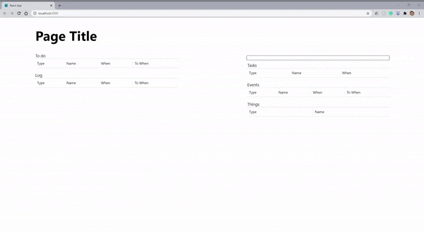

# Personal Organization Project

### Motivation
I've tried my hand at many productivity tools, and currently I've settled on Notion (surprise!) but there are still something's that I would prefer. Notion is by far the most powerful, customizable, most versatile organization management tool out there, but at the cost of speed. Here are the problems I currently have with Notion, and how I'm trying to solve them in my project:

#### Speed
My app will be sacrificing the great power and customizability that Notion offers, but will be lightning fast, and simpler for me to develop on my own.
#### Clunky table input
I've found myself spending a lot of time just entering simple things into databases in Notion. I currently use tables for keeping track of my tasks, events, and things to get to at some point, and so I'm making a universal text input that will recognize and parse the given input into one of these three options. By just typing in the data, I will be able to input many things much easier.
#### Note taking organization
With so much time taking to load so much data and powerful mechanisms, it makes it inconvenient to traverse pages to take notes. This is not just a problem with Notion, but traversing a notes hierarchy to take notes in different sections can slow things down. Through a simple set of formatting rules, from a single daily note taking space, users will be able to specify where to put single or multiple bullet points, and easily access notes for future use. The concept for this is not fully fleshed out, but as of now I am thinking that I'll be able to specify a note location, or a new note name in a bullet, then the child bullets would be placed in that note. Upon this would have some slight variations, but that is the general premise. I will try to update this when I flesh things out and work on them more.

On top of all of this, I've been wanting to break into web development, and given that this is generally simple mechanically/conceptually, I figured it would be a good starter project. I've currently been using react to make everything, and I've been starting to work with node.js, express, and postgresql to store data in case I open this up to users beyond myself in the future.

### Roadmap / Progress
Updated October 5, 2020. Here's a demo of the latest fundamental functionality. It's a bit small, but I'm showing how it takes input and parses it into different entries, as well as displays entries in different tables as I check them off or delete them, similar to linked databases in Notion.

  
Demo

 
  

Here's what the general idea looks like:
- [x] Basic input recognition and parsing
- [x] Basic linked database structure and functionality
- [x] Basic styling
- [ ] Storing a single user's (me) data either locally or on a database using express and/or postgresql
- [ ] Basic note taking system
- [ ] Advanced parsing
- [ ] Advanced note taking system
- [ ] Data storage and login for multiple users
- [ ] Probably many other things I could not imagine in its current state..

### Get Updates!
I post almost daily on my twitter ([@_alecchen](https://twitter.com/_alecchen)) with notes about what I'm working on along with other things as well. Looking forward to the future of this project!
